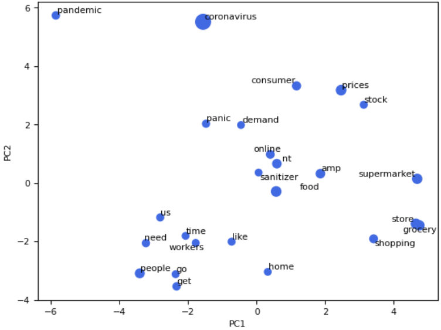
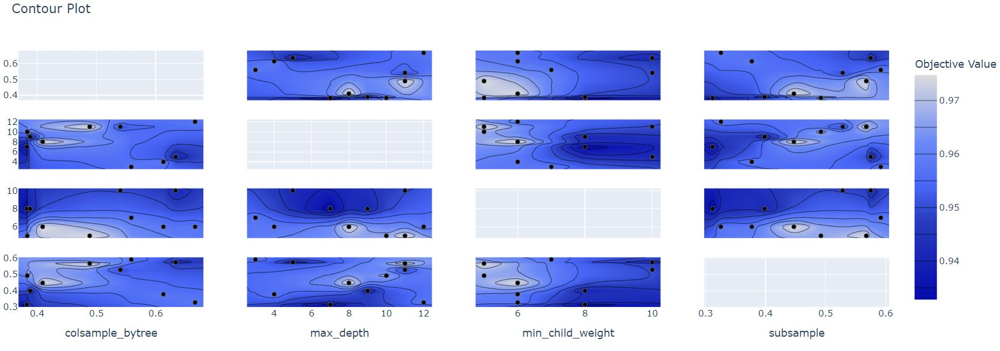
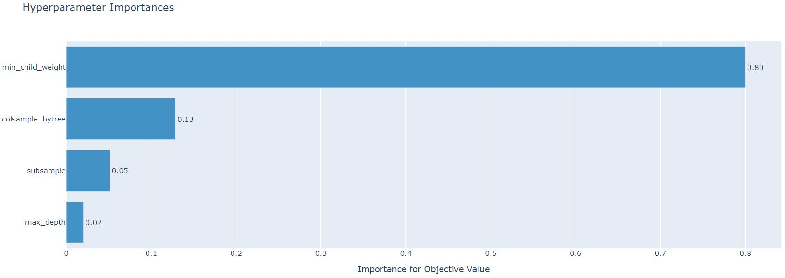

# **Machine Learning Projects**
## [Sentiment analysis (NLP)](https://github.com/berndtmihaly/data-science-projects/blob/main/Covid%20sentiment%20analysis.ipynb)
- The dataset contained tweets about COVID labelled by sentiments. My objective was to build an NLP pipeline and train a neural network to classify the tweets both at a fairly deep level of abstraction.
- My aim was to experiment with pre-trained embeddings, continue train them with transfer learning and try different regularization techniques.
- The high level structure of my approach was: data cleaning, tokenization, load pre-trained embedding, train the network.
- I have achieved a fairly similar balanced accuracy with and without the pre-trained embeddings. Data preparation was important, the usage of packed padded sequences significantly reduced training time and the results of regularizations were noticeable.
- Proposal for further analysis: train own word embeddings on a corpus with more information about COVID, classification with BERT, more efforts to clean the data.

  

  <i>First two principal components of GloVe word embeddings before training</i>

 

  

<i>Loss function and balanced accuracy with early stopping</i>

## [Classification of medical data with SVM](https://github.com/berndtmihaly/data-science-projects/blob/main/Medical%20data%20SVM%20classification.ipynb)
- The dataset contained tabular medical data with numerous missing data. The problem was introduced in the Data Mining Models and Algorithms course, and the objective was to classify the cases using SVM. I finished in 2nd place.
- The high level structure of my approach was: exploratory data analysis, outlier detection, feature engineering (encoding, transformations, scaling, feature selection), missing data imputation with KNN and apply SVM.
- I used the following embedded method for feature selection. I trained a Random Forest and then used permutation importance to select features. I then performed the classification using SVM, running experiments with all possible Kernels. For hyperparameter optimization I used a Bayesian approach with Optuna.
- Proposal for further analysis: the dataset is augmented with the chest X-ray images of the patients. A possible approach could be to train a neural network to classify the images, then extract the features and add them to the tabular observations to perform the classification using SVM.

Confusion matrix on the validation set             |  Classification report on the validation set
:-------------------------:|:-------------------------:
  |  

## [Imbalanced classification of insurance data](https://github.com/berndtmihaly/data-science-projects/blob/main/Insurance%20product%20classification.ipynb)
- The dataset contained tabular data on costumers of an insurance company. The dataset consists of 86 varibales including product usage and socio demographic data. The problem was introduced in the Data Mining Models and Algorithms course, and the objective was to classify who would be interested in buying an insurance policy using Random Forest. I finished in 1st place.
- The high level structure of my approach was: exploratory data analysis, outlier detection, feature engineering (encoding, transformations, scaling, correlation analysis, feature selection) and apply RF.
- The main challange was that the dataset was inbalanced in the sense of the response variable. In addition some features had rare values and random forest can be sensitive to the latter.
- I have done quite a lot of experiments with rare value transformation and different sampling techniques, including random over- and undersampling and variations of SMOTE. For the hyperparameter optimization I used pipeline objects, which made the experiments more flexible and faster. Interestingly I obtained the best result with the random oversampling approach.
- Since this was an imbalanced classification task, I also had to perform probability calibration, which improved my results on both the train and the validation sets.
- Proposal for further analysis: make some experiments with boosting algorithms and dimension reduction techniques, possibly PCA.

Threshold plot for imbalanced classification             |  ROC curves
:-------------------------:|:-------------------------:
  |  

## [House price regression](https://github.com/berndtmihaly/data-science-projects/blob/main/House%20Price%20Regression.ipynb)
- The dataset consists of 79 variables about houses. The problem was introduced in the Data Mining Models and Algorithms course, and the objective was to predict the logarithm of prices. I finished in 2nd place.
- The high level structure of my approach was: exploratory data analysis, missing data imputation, feature engineering (encoding, transformations, scaling), outlier detection and apply ML methods.
- The main challange was missing data imputation and feature engineering. The documentation contained important information, which in some cases gave hints on how to impute missing values. In feature engineering the creation of new variables turned out to be important.
- Proposal for further analysis: do some experiments with KNN imputation for some categorical features and regression for continuous cases, of course if it makes sense. One can observe that the residuals of the train set have more extremes in the negative values and the distribution of the validation set is more heavy-tailed in the positive values. Moreover the algorithm overestimates lower values and underestimates greater values in some cases, but there is no noticable trend in the residuals. A deeper analysis of the extremes of the residuals is needed, one possible reason being that there are still outliers corresponding to these observations in important features.

Residuals vs Predicted             |  Prediction error
:-------------------------:|:-------------------------:
  |  

## [Optimize Boosting algorithms for image classification](https://colab.research.google.com/drive/1b0i2a5Hxji9hWAwDTzxXV2VhNamEiRYs?usp=sharing)
- The dataset consists of handwritten Kannada digits. The problem was introduced in the Data Mining Models and Algorithms course, and the objective was to classify the images without any pre-processing using only boosting algorithms. I finished in 2nd place.
- I used a Bayesian approach with Optuna for tuning the hyperparameters. I have experimented with a few different types of 'strategies', which I briefly described at the beginning of this notebook.
- Proposal for further analysis: it would be interesting to compare the results with convolutional neural networks with random weight initialization and transfer learning approaches.

  

<i>Contour plot of some of the hyperparameters</i>

 

  

<i>Hyperparameter importances</i>

 

## [Bankruptcy prediction - imbalanced classification](https://github.com/berndtmihaly/data-science-projects/blob/main/Bankrupty%20prediction.ipynb)
- The dataset consists of 95 variables about companies. The objective was to classify the companies as to whether they were financially stable or not. This notebook was submitted in the course of "Mathematical Modelling - Project work" in the first semester of "Mathematical Expert in Data Analysis and Machine Learning". I got the highest mark for my work.
- The high level structure of my approach was: exploratory data analysis, correlation analysis, scaling, feature selection and apply ML methods. I used a Bayesian approach with Optuna for tuning the hyperparameters.
- The main challange was that the dataset was inbalanced in the sense of the response variable, I used SMOTE and probability calibration to solve these problems.
- Proposal for further analysis: analyze and possibly remove the outliers. Analyze the prediction errors to see if there were extreme values in the important variables.

ROC curves (train)             |  ROC curves (test)
:-------------------------:|:-------------------------:
  |  

 

  

<i>Feature importance</i>

 

  

<i>Visualize a top of a tree</i>

